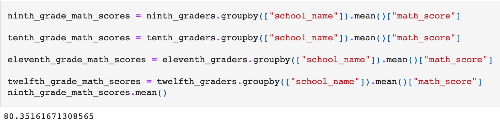

# School_District_Analysis

### Project Overview 
The purpose of this analysis was to create a thorough representation of schools and student performance  for a school board using pre-defined metrics and also adjusting the data to account for potentially altered information.

### Results 
- After removing the requested scores for 9th graders in Thomas High school the overall measurable scores was reduced by 461 and as a result the district summary was also affected with all data ranges except average reading scores recording fractional declines.

- After updating the school summary dataframe it was observed that the percentage values had also similiarly decreased as seen below :

- Because the other grades (10-12) had similiar ranges of results for both reading and math the overall impact was not greatly affected relative to other schools

- Replacing the ninth - grade results caused the overall ninth grade percentage to drop only fractionally across 

- Math and reading scores by grade 

- Scores by school spending 

- Scores by school size 

- Scores by school type

### Overall Summary

After completing this analysis I can summarize that although the scores for reading and math for grade nine students were removed 1) the average of the school did not drop significantly because of the performace of the other three(3) grades , 2) the spending per student was minimally changed which would infer higer returns on investment for the remaining student population 3)the school size relative to the other schools suggests that Medium sized schools have the best overall performance and 4) that charter schools have a significantly better overall passing rate than district schools

